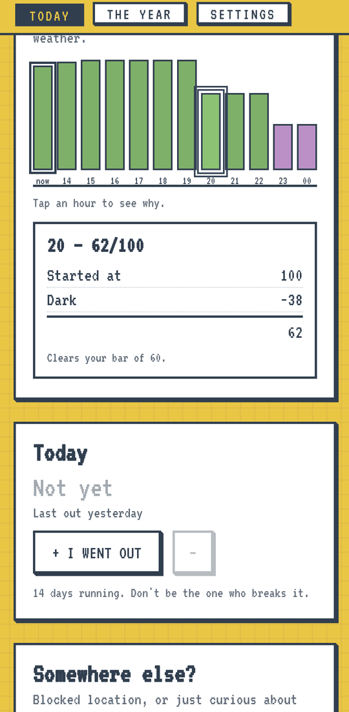
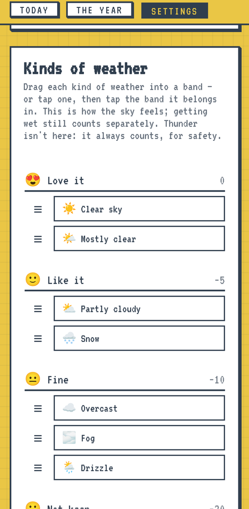
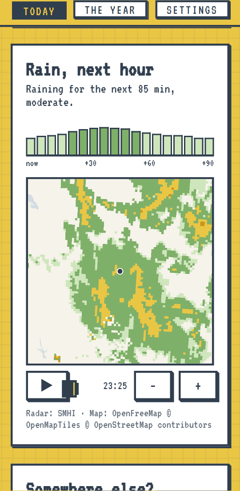
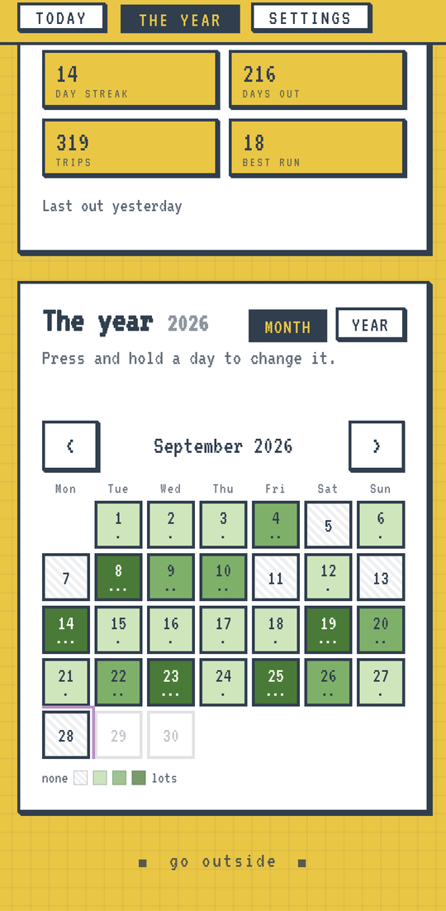

<p align="center">
  
</p>

<h1 align="center">Touch Grass</h1>

<p align="center">
  <b>Should you go outside? It looks at the sky, and tells you when.</b><br>
  An Android app and a website. No account, no ads, no tracking.
</p>

<p align="center">
  <a href="https://github.com/LxO96/Touch-grass/releases"><b>Download the APK</b></a>
  &nbsp;·&nbsp; Android 7.0+
</p>

<p align="center">
  
  
  
</p>

---

## One question, answered every day

Touch Grass blends three forecasts into a score out of 100 for right now and
each of the next twelve hours, then gives you a verdict with a time attached:
**GO OUTSIDE**, **WAIT, THEN GO**, or **GO OUT ANYWAYS**, at the least-bad hour.

It has one house rule: **until you've been out today, it will never tell you
to stay in.** Dangerous heat, cold and lightning are the only exceptions, and
even then it points you at the safest hour instead of giving up on the day.

## What's in it

- **A score you can read.** Tap any hour to see exactly what it lost points for.
- **Your weather, not ours.** Sort every kind of sky from *love it* to *hate it*,
  and dial how much rain, cold, heat, wind and darkness bother you.
- **Dusk and dawn** can count as a plus instead of a minus.
- **Firsts get a bonus.** The first rain after a dry spell, the first snow of
  the season, the first sun after grey weeks, the first warm day.
- **The aurora.** When the northern lights are likely where you are and the sky is
  clear and dark enough to see them, the hour gets a bonus, and it can send
  you an alert.
- **Rain radar**, if you want it: the next hour's rain five minutes at a time, and
  the last hour of radar around you, from SMHI in Sweden and MET in Norway.
- **A year of squares.** Every day you got out, with streaks. Press and hold a
  day to fix it.
- **A fanfare when you go out.** Logging the first trip of the day buzzes a
  little fanfare, in the app and on the widget.
- **Reminders** at a set time or before sunset, and an alert when a genuinely
  good window opens.
- **A home-screen widget** with the rest of the day hour by hour, and a
  one-tap **+** to log a trip without opening the app.
- **English and Swedish**, °C or °F, km/h, m/s or mph.

<p align="center">
  
  
  
</p>

<p align="center">
  
</p>

## Your data stays on your phone

Your year, streaks and settings live on your device. The only thing that leaves
it is the location sent to the weather services to ask about your sky.

- **Backed up automatically** with the phone's own backup, so a new phone or a
  reinstall brings it back.
- **Save or share a copy** from *Settings → Your data*, and restore from any
  copy. Restoring merges days, so nothing logged since is ever lost.

## Run it as a website

It's a static site. Serve `web/` over http so the browser will share your
location:

```
cd web && python -m http.server 8000
```

Then open <http://127.0.0.1:8000>. To pin a place instead:
`?lat=59.33&lon=18.07&place=Stockholm`.

## Under the hood

One JavaScript definition of "good weather" (`web/scoring.js`, `web/blend.js`)
runs in the page and, through [Rhino](https://github.com/mozilla/rhino), in the
Android widget and notifications, so they can never disagree about the same
afternoon.

```
cd android && gradlew assembleDebug    # build the app
node web/run-tests.js                  # the logic suite
cd android && gradlew test             # the same logic, replayed through Rhino
```

`web/scoring.js` and `web/blend.js` must stay plain ES5, because Rhino reads
them.

## Credits

Forecasts are blended from [MET Norway](https://www.met.no/) (NLOD / CC BY 4.0),
[SMHI](https://www.smhi.se/) (CC BY 4.0) and [Open-Meteo](https://open-meteo.com/)
(CC BY 4.0). Radar comes from SMHI and MET Norway, and its map from
[OpenFreeMap](https://openfreemap.org/) © [OpenMapTiles](https://www.openmaptiles.org/),
data © [OpenStreetMap](https://www.openstreetmap.org/copyright) contributors.
Aurora data comes from [NOAA SWPC](https://www.swpc.noaa.gov/).
The look is a homage to [optical.toys](https://optical.toys/).
