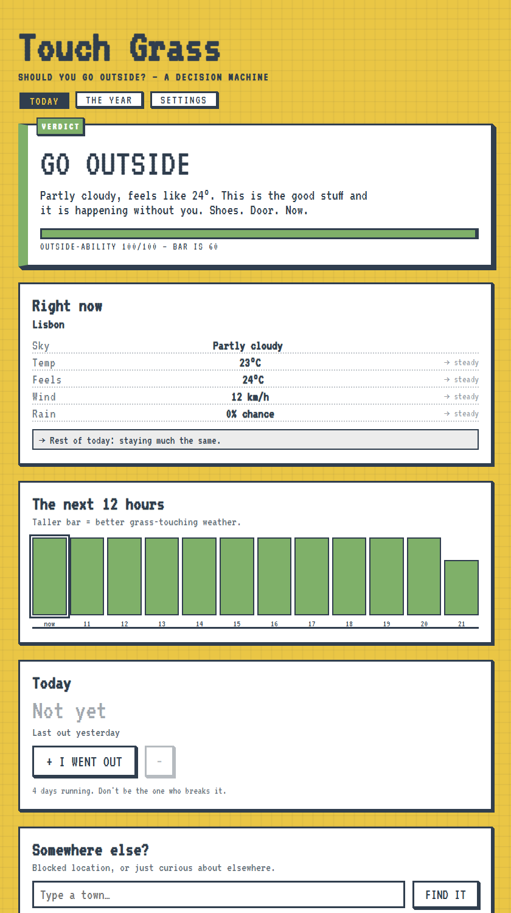
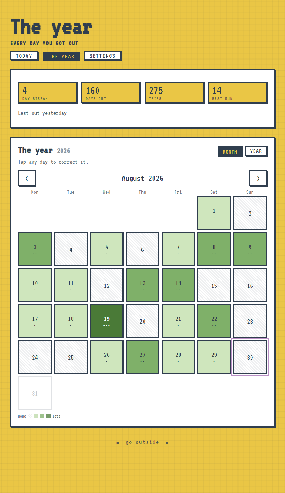
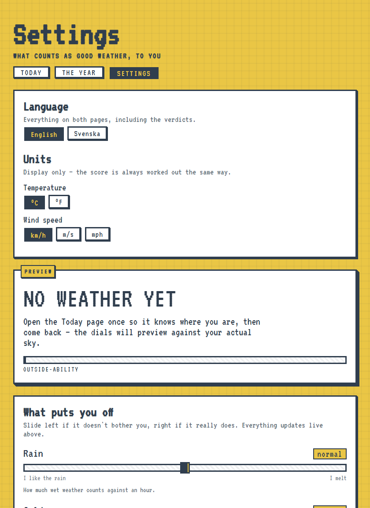
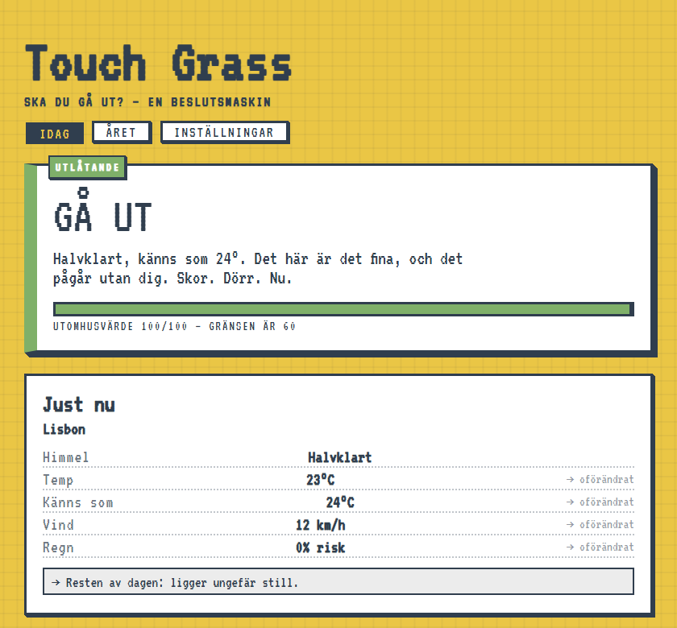
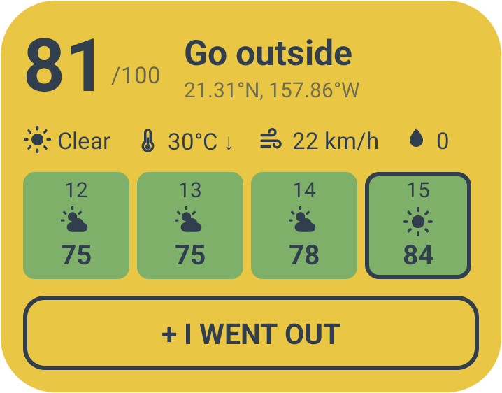

# Touch Grass

**A small website, and an Android app, with one job: get you outside every day.**

It weighs the current weather, the next twelve hours of forecast, and whether
you have already been out today — then tells you what to do about it.

<br clear="left">

<p align="center">
  
  &nbsp;
  
</p>

---

## The house rule

**If you haven't been outside yet today, it will never tell you to stay in.**
The worst it will say is *"not yet — go at four"*. There is always a time
attached.

| Verdict | When you get it |
| --- | --- |
| **GO OUTSIDE** | It's good out right now. |
| **WAIT, THEN GO** | Rough now, but a genuinely better hour is coming. It names it. |
| **GO WHEN IT IS LIGHT** | It's dark, and dawn is within sight. |
| **GO OUT ANYWAYS** | Today never gets good. It picks the least-bad hour and sends you there. |
| **STAY IN. YOU EARNED IT.** | Only ever reachable *after* you've logged a trip. |

The one thing that overrides all of it is safety. Dangerous heat (feels like
38 °C or more), dangerous cold (−15 °C or below) and lightning will never be
talked into a "go" — in those conditions it points at the safest hour instead,
still with a time attached, never "give up on today".

## What it does

- **A score out of 100** for right now, and for each of the next twelve hours.
- **Trends** — where every reading is heading for the rest of the day.
- **A year of squares**, one per day, shaded by how many trips. Streaks too.
- **Reminders** at a set time, or a chosen stretch before sunset.
- **An alert** when a genuinely good window opens, so a rare fine afternoon in
  November doesn't pass you by.
- **A home-screen widget** that grows with the space you give it.
- **English and Swedish**, °C/°F, and km/h ÷ m/s ÷ mph.

<p align="center">
  
  &nbsp;
  
</p>

## Get the app

Grab the APK from **[Releases](https://github.com/LxO96/Touch-grass/releases)**
— Android 7.0 or newer. You'll need to allow installing from an unknown source.
There's no Play Store listing, no account, and no telemetry.

Or build it yourself, which takes one command:

```
cd android
gradlew assembleDebug
```

The APK lands in `android/app/build/outputs/apk/debug/`. Install it with
`adb install -r <that file>`, or just copy it to the phone and tap it.

## Run it as a website

Any static file server, pointed at `web/`. It needs http rather than a
`file://` path, or the browser won't hand over your location:

```
cd web
python -m http.server 8000
```

Then open <http://127.0.0.1:8000>. Prefer not to share your location? Use the
town search, or pin a place with `?lat=38.72&lon=-9.14&place=Lisbon`.

## Your data stays yours

Everything lives in `localStorage` on your own device — the year, the streaks,
the settings. Not cookies: cookies cap out around 4 KB and ride along with every
request to a server, and there is no server here.

Nothing is sent anywhere except the coordinates needed to ask three weather
services — [MET Norway](https://www.met.no/), [SMHI](https://www.smhi.se/) and
[Open-Meteo](https://open-meteo.com/) — what the weather is doing, blended
into one forecast. There is no account and no analytics.

Clearing site data wipes your year, so **Settings → Your data** offers
*Share / email it*, which hands the whole log over as a `.json` file through
Android's share sheet — Drive, Gmail, Files, whatever you have. Any copy will
restore.

## Running the tests

`web/test.html` is the logic suite — open it in a browser and read the tally
at the foot. The same tests run in a terminal, and exit non-zero on a failure:

```
node web/run-tests.js
```

The Android side has its own, which evaluates `web/scoring.js` through Rhino
so the two runtimes cannot drift:

```
cd android && gradlew test
```

## How the score works

`web/scoring.js` is the single definition of what "good weather" means. Every hour
starts at 100 and loses points for rain, uncomfortable apparent temperature,
wind, darkness, and rough weather codes. Each subtraction is multiplied by a
dial you control, so a dial at 0 removes that factor entirely and 2 doubles it.

`tgDecide()` then compares now against the next twelve hours. A future hour only
counts as a window worth waiting for if it clears your bar **and** beats right
now by twelve points — otherwise you'd be told to wait around for a
barely-different hour.

### One formula, two runtimes

The Android background check can't reach the WebView, so it can't run the page's
JavaScript directly. Rather than port the formula (or the blend) to Kotlin and
let copies drift apart, the worker evaluates **`web/scoring.js` and
`web/blend.js`** through [Rhino](https://github.com/mozilla/rhino), a plain-Java
JavaScript engine. Kotlin's job is three HTTP GETs — MET Norway, SMHI,
Open-Meteo — handed to Rhino as raw response bodies; it never parses a
forecast payload. The page, the notifications and the widget can never
disagree about whether it's nice out.

`tgDecide()` and `tgTrends()` deliberately return states and directions, never
words — which is what lets the page write a paragraph in your language while the
widget draws four words and an arrow from the identical reading.

Two constraints come with that, both worth knowing before you edit anything:

- **`web/scoring.js` must stay plain ES5.** `var` and `function`, no arrow
  functions, template literals or `??`, and no DOM or storage. Rhino reads it.
- Rhino is pinned to **1.7.15**. Newer versions use `MethodHandle`, which would
  force `minSdk` up to 26.

## The widget

<p align="center">
  
</p>

The sky icon changes with the weather code, which is also why the sky reading
needs no translation. Readings that are actually *moving* carry an arrow; steady
ones don't, because five arrows all pointing sideways is just noise.

It grows with the space you give it — drag its edges:

| Height | What you get |
| --- | --- |
| any | score, recommendation, the five readings |
| ~110 dp+ | ...plus a **+ I WENT OUT** button |
| ~200 dp+ | ...plus the last five weeks as a heatmap |

Logging a trip from the widget is a little awkward under the bonnet: the log
lives in the page's `localStorage`, which a widget tap cannot reach. So the tap
is parked on the Android side, the widget updates immediately, and the page
folds it into the real log next time it opens. `localStorage` stays the only
source of truth.

## Tests

```
cd web && python -m http.server 8000   # then open /test.html    201 assertions
cd android && gradlew test                                     #   7 assertions
```

The web suite covers the verdicts, the house rule (swept across temperatures,
hours, weather codes and dial settings to prove "stay in" can't leak out before
your first trip), the safety overrides, trends, units, both languages, the log
and streak counting.

The Kotlin suite replays **1460 scoring cases generated by running
`web/scoring.js` in a real browser** back through Rhino, proving the engine agrees with the
browser. If you change the formula, regenerate those fixtures.

## Layout

```
web/             the app itself — a static site, no build step
  index.html  calendar.html  settings.html      the three pages
  scoring.js     the score and the decision — shared with Android via Rhino
  blend.js       merges MET/SMHI/Open-Meteo into one forecast — also shared
  lang.js        every visible string, English and Swedish
  core.js        storage, units, trends, the verdict's wording
  app.js         the Today page     record.js   the year page
  settings.js    the settings page  test.html   the test suite
android/         the Android wrapper: WebView shell, background check, widget
docs/            screenshots for this README
```

`android/` builds `web/` straight into the APK — the Gradle `copyWebApp` task
copies those files into assets, and fails the build if any of them is missing.
There is no second copy of the site to keep in step.

## Credits

Weather is blended from three services: [MET Norway](https://www.met.no/)
(the best model for the Nordics, and the reason it carries half the weight),
[SMHI](https://www.smhi.se/) and [Open-Meteo](https://open-meteo.com/), which
also supplies sunrise/sunset and the town search. All free and open;
Open-Meteo is licensed CC BY 4.0.

The look is a homage to [optical.toys](https://optical.toys/) — the VT323
typeface, the mustard and slate, and the hard blur-free shadows are borrowed
with admiration.
